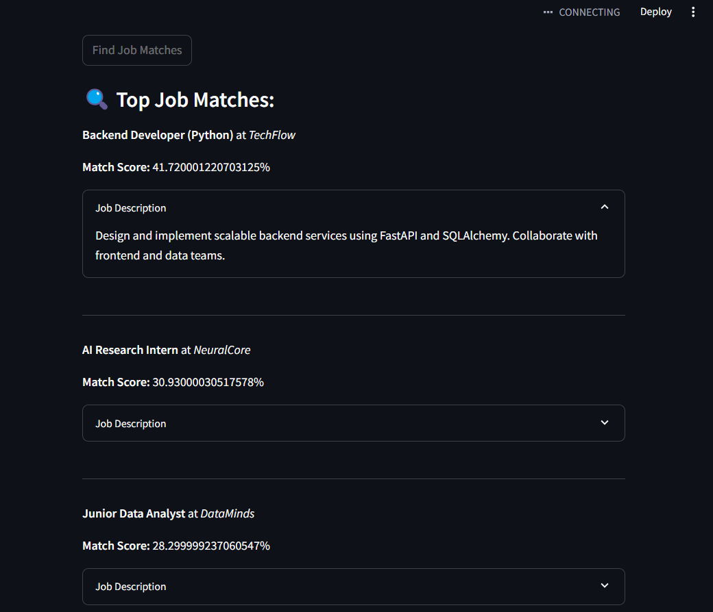
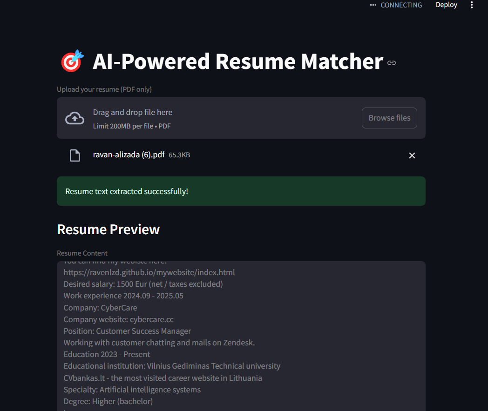
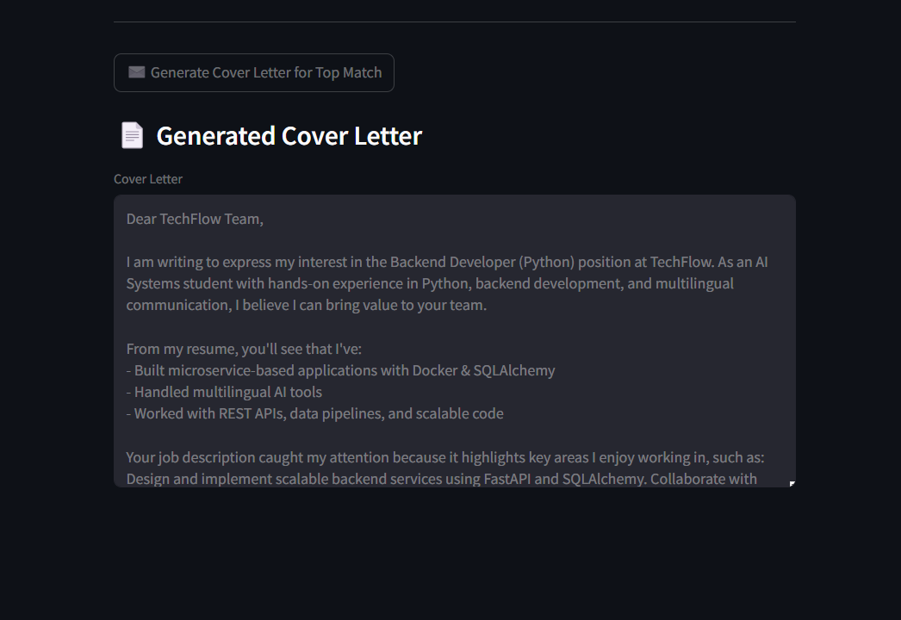

# 🎯 AI Resume Matcher

A smart, AI-powered web app that matches your resume to job descriptions using semantic similarity — all without requiring a GPT API key. Built with Streamlit, this app also generates a personalized cover letter based on the top job match.

---

## 🚀 Features

✅ Upload your resume (PDF)  
✅ Extract and display resume text  
✅ Compare it to sample job descriptions  
✅ Use Sentence Transformers for semantic similarity  
✅ View top 3 matched job roles with match scores  
✅ Generate a custom cover letter locally (no GPT key needed)  
✅ Clean, responsive UI built with Streamlit  

---

## 🧠 How It Works

1. Upload your PDF resume  
2. The app extracts text and embeds it using a transformer model (`all-MiniLM-L6-v2`)  
3. Job descriptions are also embedded  
4. Cosine similarity scores are used to rank jobs  
5. A personalized cover letter is generated using a structured template

---

## 📸 Screenshots

| Resume Upload | Matched Jobs | Cover Letter |
|---------------|--------------|--------------|
|  |  |  |

---

## 🛠️ Tech Stack

- **Frontend & App**: [Streamlit](https://streamlit.io/)
- **NLP & Embedding**: [Sentence-Transformers](https://www.sbert.net/)
- **Similarity Scoring**: `scikit-learn` + Cosine Similarity
- **PDF Parsing**: `pdfplumber`
- **Local Cover Letter Generator**: Python templates (no external API)

---

## 📂 File Structure

